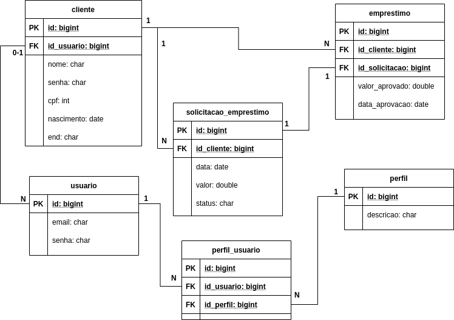

# Emprestimos

Prova de conceito para representar o teste enviado pela TQI

# Cenário
Uma empresa de empréstimos precisa atualizar seu sistema de análise de crédito para fornecer aos seus clientes um aplicativo com as seguintes funcionalidades:
i.	Cadastro
ii.	Login
iii.	Solicitação de empréstimo
iv.	Acompanhamento das propostas

# Stack Utilizada
  - API Rest utilizando Spring
  - Spring JPA
  - Spring WEB
  - Banco de dados MySQL

# Modelagem de dados

